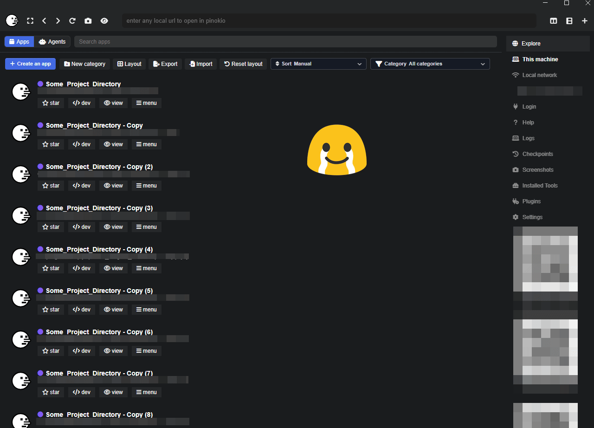
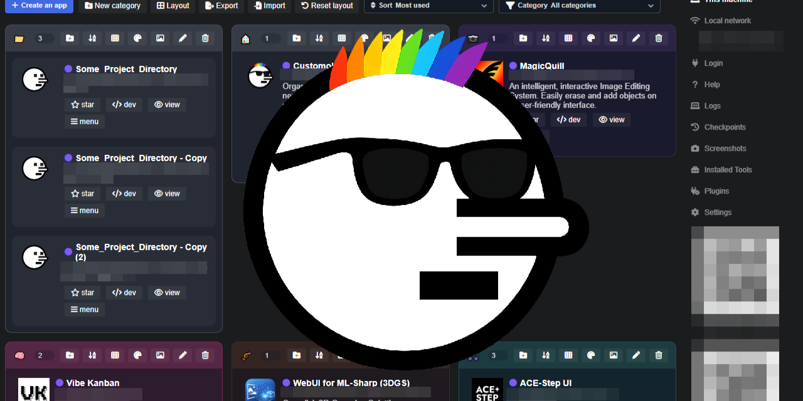
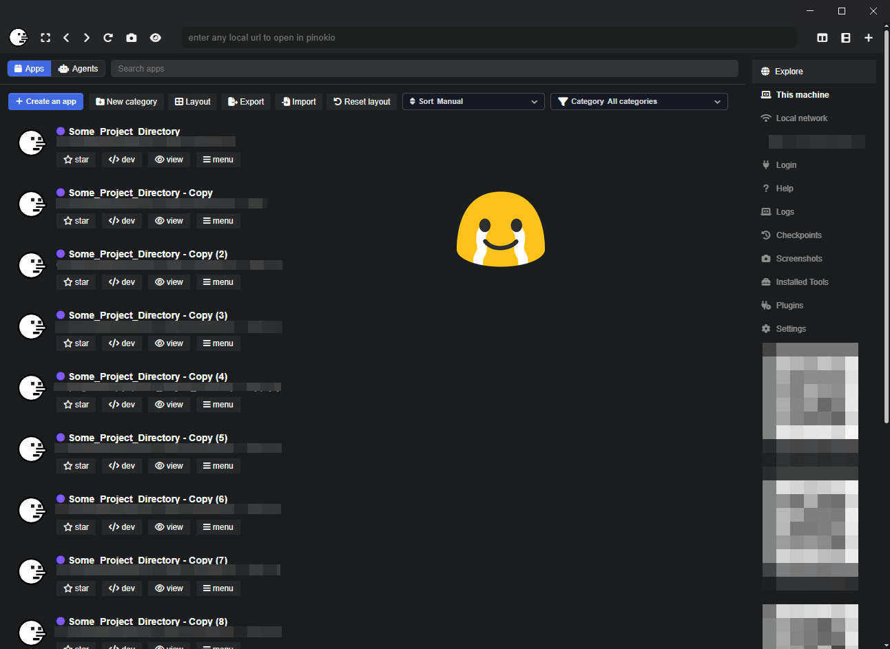
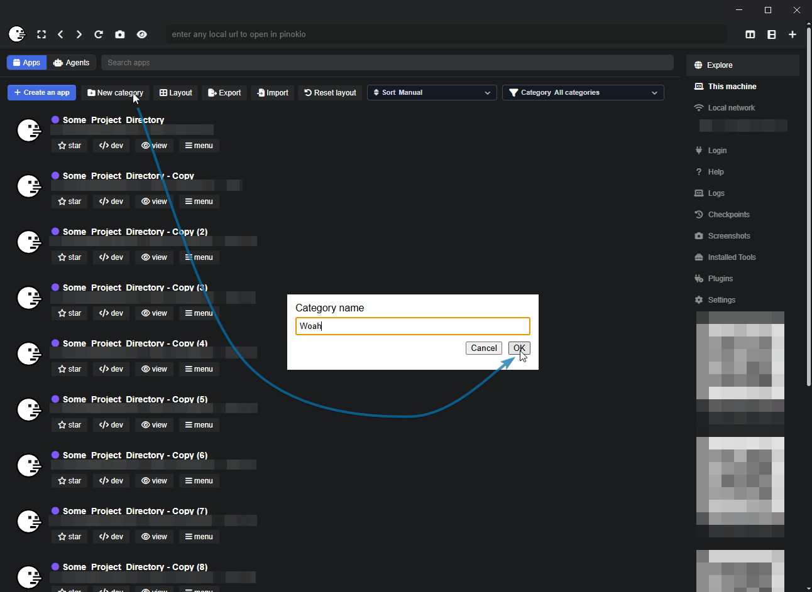
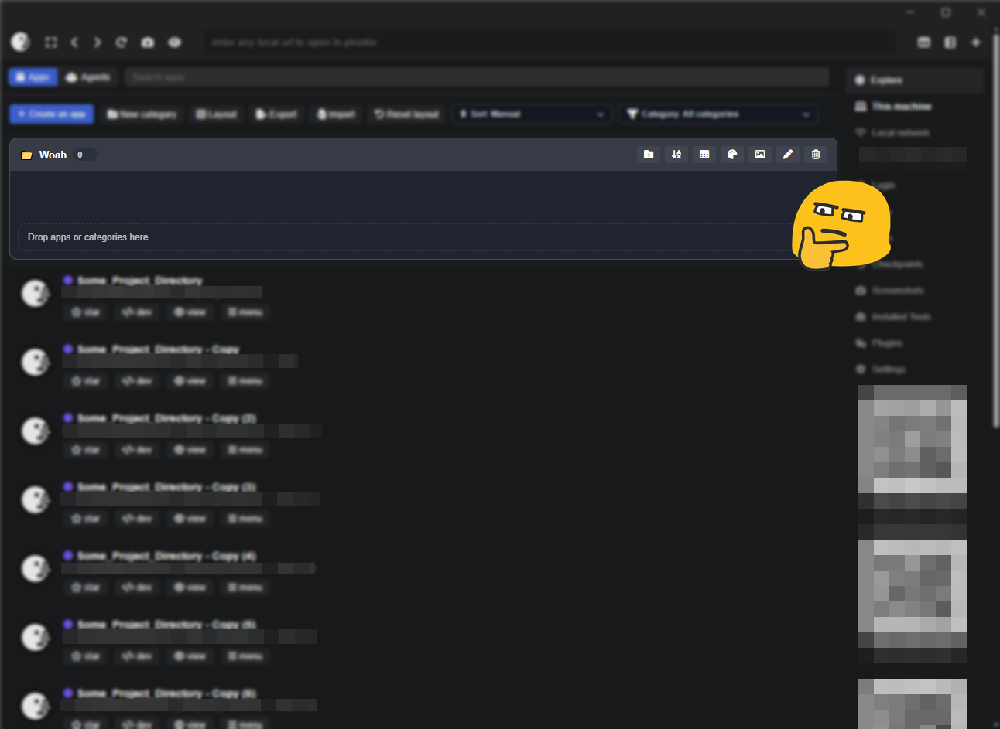
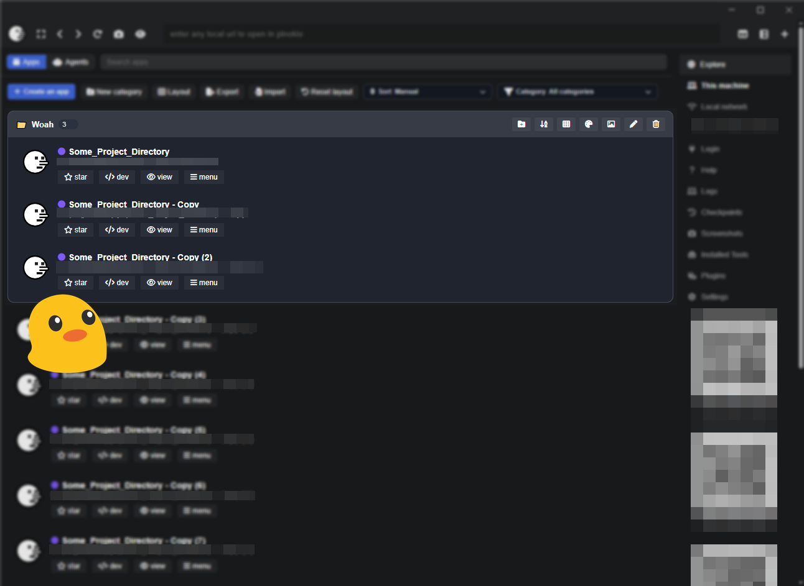
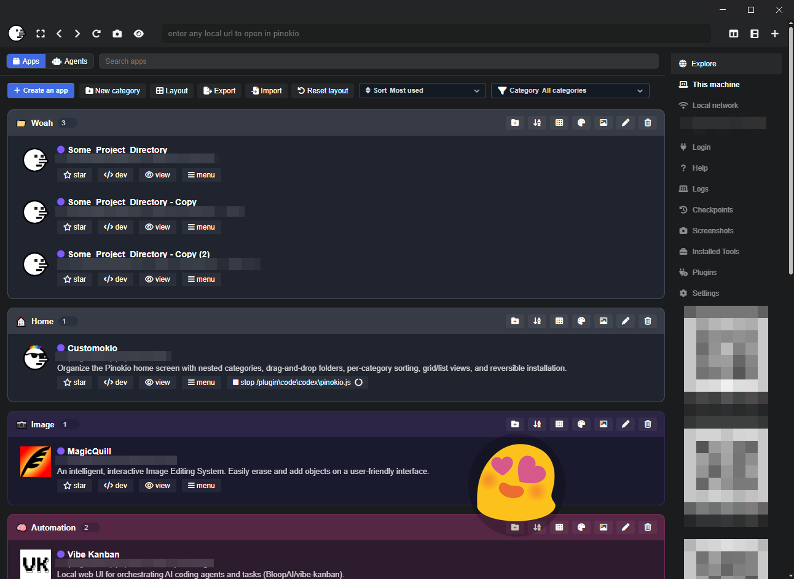
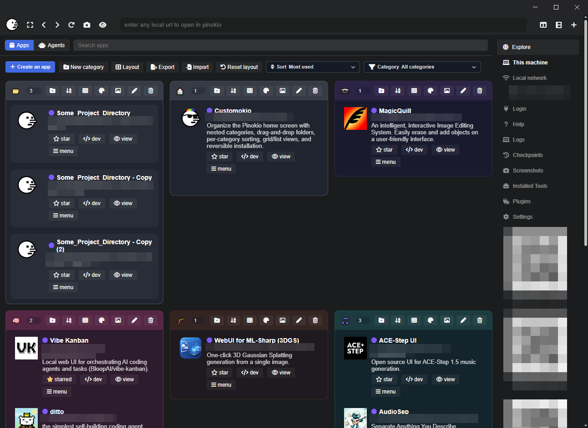

# Customokio

Customokio is a reversible Pinokio home-screen customization that adds categories, nesting, drag-and-drop organization, per-category views, and client-side sorting without replacing the overall Pinokio look and feel.

It installs through Pinokio's supported `PINOKIO_HOME/web` customization path, so it behaves like a customization layer, not a fork of Pinokio core.

!!!!!!!!!!!!!!!!!!!!!!!!!!!!!!!!!!!!!!!!!!!!!!!!!!!!!!!!!!!!!!!!!!!!!!!!
!!!!!!!!!!!!!!!!!!!!!!!!!!!!!!!!!!!!!!!!!!!!!!!!!!!!!!!!!!!!!!!!!!!!!!!!

### IMPORTANT: SAFE UNINSTALL ###

!!! DO NOT DELETE THE CUSTOMOKIO PACKAGE FOLDER FIRST !!!

Use `Safe Remove` from the Customokio package page, or `Safe Delete` from the Customokio home-card menu.

Deleting the package folder first can leave the Pinokio home override behind.

!!!!!!!!!!!!!!!!!!!!!!!!!!!!!!!!!!!!!!!!!!!!!!!!!!!!!!!!!!!!!!!!!!!!!!!!
!!!!!!!!!!!!!!!!!!!!!!!!!!!!!!!!!!!!!!!!!!!!!!!!!!!!!!!!!!!!!!!!!!!!!!!!



## What It Does

Customokio keeps the normal Pinokio home page structure and adds an organization layer on top of the existing app cards.

Feature highlights:

- Create top-level categories.
- Create nested subcategories.
- Drag apps into categories and subcategories.
- Drag categories into other categories.
- Rename categories.
- Collapse or expand all categories at once.
- Collapse and expand categories with double-click.
- Switch the overall category container layout between `Stacked view`, `Folder view`, and `Flow view`.
- Switch each category's app display between `List view` and `Grid view`.
- Sort each category independently:
  - `Manual order`
  - `A-Z`
  - `Most used`
  - `Last opened`
- Reset usage history for a single category subtree.
- Filter the home screen by top-level category.
- Search across the reorganized home screen.
- Star apps and keep starred state available even when Pinokio's server-side star endpoint is unavailable.
- Color-code categories.
- Assign category icons.
- Use in-page category dialogs instead of browser prompts, so naming and renaming stay inside the Pinokio window.
- Export and import the layout as JSON.
- Restore the default Pinokio home page.
- Open the launcher to the README by default so `Apply`, `Reapply`, and `Safe Remove` stay manual actions.
- Choose between `Reapply` for the current local version and `Update + Reapply` to pull the latest package changes from GitHub first.



## What It Does Not Do

Customokio is intentionally client-side for organization behavior.

- It does not change Pinokio server behavior.
- It does not rewrite app metadata on disk.
- Category layout, local star fallback, and usage-based sort history are stored in browser local storage.
- On Pinokio builds where the `/apps/preferences/:id` endpoint is unavailable, star state falls back to local browser storage.

## Feature Walkthrough

### Familiar Pinokio Home, Better Organized

Customokio keeps the stock Pinokio home structure and layers categories on top instead of replacing the page.



### Create Categories Quickly

Use `New category` to make top-level organization buckets without leaving the home screen.



### Fill Categories With Apps And Subcategories

Drag apps into a category, create subcategories, and build out a nested structure that matches how you actually browse your tools.





### Switch Views And Work With Multiple Groups

Use stacked layout when you want everything expanded vertically, folder layout when you want rigid columns, or flow layout when you want denser top-level packing with less dead space between categories.





## Recent Updates

- Added a Customokio-only `Safe Delete` path in the home-card menu that runs `Safe Remove` first, then deletes the package folder.
- Fixed an encoding regression that could render category icons as garbled symbols, and added automatic repair for already-saved broken category icons on load.
- Improved runtime reattachment so Customokio now reapplies itself automatically if Pinokio refreshes the home screen after app start/stop state changes.
- Added `Flow view` as a third top-level layout mode for denser category packing than `Folder view`.
- Reduced the startup flash of the stock Pinokio home before the Customokio layer initializes.
- Improved startup initialization so Customokio now applies correctly even when Pinokio opens with no running apps.
- Replaced browser-native category naming prompts with an in-page modal so `New category`, `Add subcategory`, and `Rename category` stay on top of the Pinokio window.
- Restored the standard `Apply`, `Reapply`, `Update + Reapply`, and `Restore Default` launcher actions after the refresh-mode flow caused installs to appear inactive on some Pinokio setups.
- Fixed the category count badge so it sizes correctly and no longer collides with controls in folder/grid mode.
- Improved removal guidance and restore behavior so uninstalling Customokio is less likely to strand a broken override state.
- Split manual maintenance into two actions:
  - `Reapply` reinstalls the current local Customokio files
  - `Update + Reapply` runs `git pull` first, then reinstalls
- Changed the launcher so it opens to `README` by default instead of auto-selecting `Apply` or `Reapply`.
- Added an AppData `manifest.json` so backup locations remain easy to inspect manually.
- Added safer backup handling for Pinokio home overrides:
  - primary backups now live in `%APPDATA%\Pinokio\Customokio\backup\`
  - `.customokio.bak` sidecars are also written next to the live override files
  - restore now checks AppData backups first, then sidecars, then legacy `state/backup` files

## How Installation Works

Customokio now keeps two backup copies of any existing Pinokio home overrides before it replaces them:

- a primary backup in `%APPDATA%\Pinokio\Customokio\backup\`
- a `.customokio.bak` sidecar next to each live override file in `PINOKIO_HOME/web/views/...`

When you click `Apply`, the launcher:

- backs up any existing `web/views/index.ejs` into `%APPDATA%\Pinokio\Customokio\backup\index.ejs`
- backs up the sidebar partials into `%APPDATA%\Pinokio\Customokio\backup\partials\...`
- writes `.customokio.bak` sidecar backups next to the live override files for convenience
- writes `manifest.json` into the AppData backup folder
- copies the Customokio home template into `PINOKIO_HOME/web/views/index.ejs`
- copies the required partials into `PINOKIO_HOME/web/views/partials/`
- copies the client assets into `PINOKIO_HOME/web/public/`

When you click `Safe Remove`, the launcher:

- restores the backed-up template and partials from AppData first
- falls back to the `.customokio.bak` sidecars if the AppData backup is unavailable
- falls back to legacy `state/backup` files if they still exist from an older install
- removes the Customokio assets from `PINOKIO_HOME/web/public/`
- removes its own temporary install state

If the override files under `PINOKIO_HOME/web/views/...` are completely missing, Pinokio should fall back to its built-in bundled home UI. The broken state is when a custom `index.ejs` override still exists but the partials it depends on are missing.

Action summary:

- `Apply`: first-time installation
- `Reapply`: reinstall the current local Customokio files
- `Update + Reapply`: run `git pull`, then reinstall the latest package files
- `Safe Remove`: restore the original Pinokio home files before removing the package

## How To Use

1. Open the Customokio package in Pinokio.
2. Click `Apply`.
3. Refresh the Pinokio home page.
4. Use `New category` to create categories.
5. Drag apps and categories where you want them.
6. Use the category action buttons to:
   - add subcategories
   - change sort mode
   - reset category usage
   - switch category item view
   - set color
   - set icon
   - rename
   - delete
7. Use the top controls to:
   - collapse all categories
   - expand all categories
   - switch layout mode
   - export layout
   - import layout
   - reset layout
   - filter by category
8. If you want to remove Customokio from the package page, click `Safe Remove` before uninstalling the package.
9. If you want to remove Customokio from the home screen menu, use the `Safe Delete` item on the Customokio app card. It restores the default Pinokio home first, then deletes the package folder.
10. Use `Reapply` when you want to reinstall your current local version, or `Update + Reapply` when you want Customokio to `git pull` the latest repo changes before reinstalling.

If you apply Customokio while other apps are already running and the home screen does not visibly change right away, refresh the Home page once or restart Pinokio. The override files may already be in place even if the currently visible home screen has not rerendered yet.

If Pinokio refreshes the home screen after apps start or stop, Customokio now detects that redraw and reapplies its grouped layout automatically.

## Best For

Customokio is useful if you want to:

- separate apps by project, workflow, or media type
- keep frequently used tools grouped together
- collapse less-used sections until you need them
- switch between a compact folder view and a more detailed stacked view
- keep all organization local to your browser without changing Pinokio app metadata

## Storage And Privacy

Customokio stores client-side state in browser local storage:

- layout tree
- category color/icon/view/sort settings
- local usage history for `Most used` / `Last opened`
- local star state fallback, when the Pinokio server preference endpoint is unavailable

Customokio's home-screen behavior is local to the browser UI:

- it does not send your category layout, sorting, stars, or other customization state to any external server
- it does not read, use, or transmit your stored credentials, API keys, login tokens, or similar secrets
- it reorganizes the existing Pinokio home page only and keeps its own state in local browser storage

Backup copies of the overridden home files are stored locally on your machine:

- primary backup: `%APPDATA%\Pinokio\Customokio\backup\`
- convenience sidecars: `PINOKIO_HOME/web/views/*.customokio.bak`

These backup files are not uploaded anywhere. The AppData `manifest.json` only records backup file locations and update metadata.

The repository itself does not need your machine name, user name, LAN IP, or local paths to work.

## Files

Main files in this package:

- `pinokio.js`: launcher UI
- `install.js`: apply customization
- `reapply.js`: reinstall the current local Customokio files
- `reset.js`: restore previous/default state
- `update.js`: pull the latest package files from GitHub, then reinstall them
- `web/views/index.ejs`: customized home template
- `web/views/partials/main_sidebar.ejs`
- `web/views/partials/peer_access_points.ejs`
- `web/public/customokio.js`: client logic
- `web/public/customokio.css`: styling
- `web/public/sortable.min.js`: bundled drag-and-drop dependency

## API Notes

This project does not expose a server-side layout API.

Available browser-side helper:

```javascript
window.Customokio.getState()
window.Customokio.resetLayout()
```

Example:

```javascript
const snapshot = window.Customokio.getState()
console.log(snapshot)
```

There is no supported curl endpoint for writing layout state because the customization is client-side.

## 🚀 Publishing Notes

If you publish this repository, publish the launcher package itself, not your runtime state.

Safe to keep out of version control:

- `state/`
- `logs/`
- `cache/`
- `.pinokio-temp/`
- any manually captured local runtime files outside the tracked package

## 🔗 References

- Pinokio customization docs: https://pinokio.co/docs/#/?id=customization
- Pinokio repository: https://github.com/pinokiocomputer/pinokio
